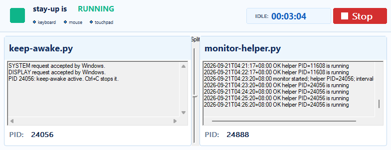

# stay-up

`stay-up` is a small Windows keep-awake helper. It asks Windows to keep the
system and display awake while the helper runs. It needs no installer,
administrator access or third-party Python packages. The dashboard also needs
Python and the documented Rust toolchain.



## Run

Run the Rust application from PowerShell in `D:\Apps\stay-up`:

```powershell
python .\launch.py
```

For a timed test, add `--seconds N`:

```powershell
python .\launch.py --seconds 3
```

The launcher checks the documented Rust paths and active toolchain. It builds to `%LOCALAPPDATA%\Rust\target\stay-up`. It starts only
the Rust executable. Its JSON result gives the status, process ID, executable
path, and window handle.

The application starts `keep-awake.py` and `monitor-helper.py`. Its window
shows their process IDs, output, the shared heartbeat log, and input idle time.
Use the Split slider to size the panes. Use Stop to end all three processes.
The X button minimizes the window.

If a stable-path instance already runs, the launcher reports it and does not
apply new arguments. Use Stop before you start a new timed test. The launcher
checks only the Rust process and its owned `StayWatchStatusWindow`.

An agent needs permission to write to the stable output path. If the sandbox
denies access, authorize the same launch command. Do not change access-control
lists or select a different output directory.

Run the helper by itself when you do not need the dashboard:

```powershell
python .\keep-awake.py
python .\keep-awake.py --seconds 7200
```

Press Ctrl+C to stop the helper and release its power requests.

## Behavior and limits

- The helper requests `SYSTEM` and `DISPLAY` availability.
- It does not change the registry, power plan, lock settings, or startup settings.
- It does not simulate keyboard, mouse, or touch input.
- Input in the current session resets the idle timer.
- The monitor records process liveness about once each minute.
- The heartbeat does not prove the state of each Windows power request.
- The heartbeat does not record lock, display, sleep, idle, image, or video data.
- A final `STOPPED` record is not guaranteed after the Rust Stop action.

Windows accepted both power requests during the recorded tests. A short helper
run used about 18 MiB of memory. Device policy can still limit the result. The
pending idle, sleep, and lock checks are in the
[observation log](docs/observations.md).

The visual refresh preserves the accepted native output panes from commit
`fed8eb5`. Screenshot logging and capture tests are outside the current scope.
See the [visual plan](docs/visual-refresh-plan.md) and
[baseline contract](docs/native-output-panes.md#accepted-working-baseline).

## Issue context and design history

The uploaded issue media records the problem that shaped this project. It shows
the helper beside the Rust window, terminal windows, idle timers, and one
Windows sign-in screen. The media shows context only. It does not prove that
the helper prevented lock or sleep.

### Initial plan

The first plan proposed a passive Rust observer. It would measure input idle
time, display state, session state, power state, and helper-process life. It
would not make power requests, simulate input, or change Windows settings. A
state gap would end a confirmed interval.

### Current design

The current app uses a Rust launcher and two unchanged Python helpers. The Rust
window shows status, helper output, the shared heartbeat log, and input idle
time. It owns shutdown and keeps the output panes read-only. Screenshot and
capture logging from the first plan are withdrawn.

### Issue images and videos

The images and videos remain linked to their original GitHub uploads. See the
[media record](docs/issue-media.md) for descriptions and limits.


- [Issue #6 video 1, about 20 seconds](https://github.com/user-attachments/assets/026dbf2b-b647-48ac-8ce2-76328c979dd1)
- [Issue #6 video 2, about 8 seconds](https://github.com/user-attachments/assets/f9bf4b8c-7cc1-4d44-a729-5eaa1bce87b7)
- [Issue #7 video 1, about 9 seconds](https://github.com/user-attachments/assets/cba1ad29-38b9-4b74-ab3a-e5758a88e1d9)
- [Issue #7 video 2, about 8 seconds](https://github.com/user-attachments/assets/1630e4a0-b3f7-4a00-ab97-dea76c8163ca)

The images and videos are user-submitted evidence. They are not controlled
test results. Video playback and audio were not reviewed in this repository.

## Privacy

The repository includes the user-submitted issue media by design. It may show
desktop, account, or sign-in context. The local dashboard preview is a separate
repository asset.

### Runtime data and portability

The application does not read names, emails, credentials, account files, or
network data. It uses Windows power APIs, process IDs, window handles, idle
ticks, timestamps, and local log files.

The launcher requires the checkout at `D:\Apps\stay-up`. It also requires
`%LOCALAPPDATA%` and the documented Rust environment variables. These values
are machine configuration, not personal identity data.

The launcher reports an absolute executable path in its JSON result. On
Windows, that path can contain the account name from the profile path. The
path is diagnostic output and is not an input to the application.

The optional probes in `tools/` can inspect device names or window content.
They are not part of the application launch path.

## Development

Read the [Rust environment procedure](docs/rust-environment-verification.md)
before you install, move, or troubleshoot Rust. Installation and version output
do not prove that the environment can build and run this project.

The repeatable probe is in `tools/rust-install-check/`. Record new machine
results in [docs/observations.md](docs/observations.md). Documentation-only
changes do not require a new machine test.

| Document | Purpose |
|---|---|
| [Visual refresh plan](docs/visual-refresh-plan.md) | Current presentation scope and limits |
| [Native output panes](docs/native-output-panes.md) | Accepted working baseline |
| [Observation log](docs/observations.md) | Dated machine and application results |
| [Feasibility record](docs/stay-watch-feasibility.md) | Historical probes and remaining unknowns |
| [Observer proposal](docs/stay-watch-plan.md) | Historical observer design |
| [Acceptance vectors](docs/stay-watch-acceptance.md) | Unexecuted historical checks |
| [Research record](docs/research.md) | Source provenance and earlier investigation |

The PowerToys source snapshot keeps its
[MIT license](research/powertoys-source/LICENSE) and
[third-party notices](research/powertoys-source/NOTICE.md). This repository is
independent of Microsoft. It is not an official PowerToys distribution.
